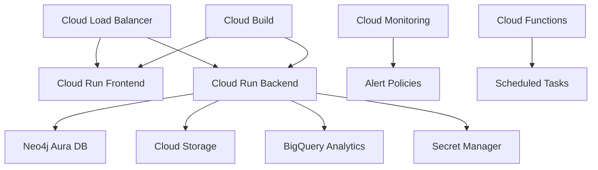
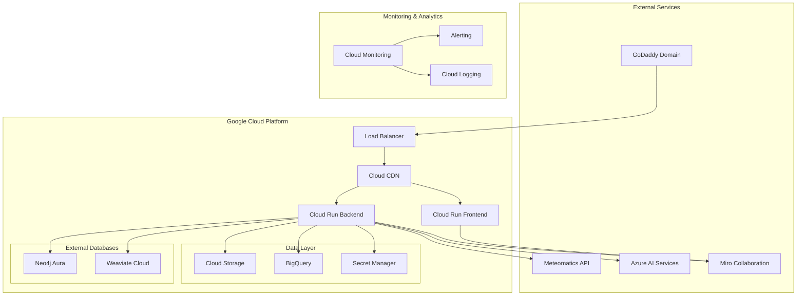

# 🌐 BioNexus Cloud Deployment & Integration Strategy

## 🚀 Complete Cloud Migration Plan

This comprehensive guide transforms BioNexus from a local application into a globally accessible, enterprise-grade platform leveraging the best cloud technologies and collaboration tools.

---

## 📋 Table of Contents

1. [Overview](#overview)
2. [Resource Utilization Strategy](#resource-utilization-strategy)
3. [Architecture](#architecture)
4. [Deployment Instructions](#deployment-instructions)
5. [External Integrations](#external-integrations)
6. [Monitoring & Analytics](#monitoring--analytics)
7. [Security & Compliance](#security--compliance)
8. [Cost Optimization](#cost-optimization)
9. [Maintenance & Support](#maintenance--support)

---

## 🎯 Overview

### Transformation Goals
- **Global Accessibility**: Deploy on cloud infrastructure for worldwide access
- **Scalability**: Handle thousands of concurrent users and large datasets
- **Collaboration**: Integrate real-time collaboration tools for research teams
- **Intelligence**: Enhance with AI/ML capabilities from multiple providers
- **Reliability**: 99.9% uptime with automated failover and disaster recovery

### Key Benefits
- ✅ **Zero Downtime Deployment**: Blue-green deployment with Cloud Run
- ✅ **Auto-scaling**: Handles traffic spikes automatically
- ✅ **Global CDN**: Fast access from anywhere in the world
- ✅ **Real-time Collaboration**: Miro integration for team research
- ✅ **Enhanced AI**: Azure Cognitive Services + existing ML models
- ✅ **Environmental Context**: Meteomatics weather/space data correlation
- ✅ **Cost Effective**: Pay-per-use cloud services

---

## 🌍 Resource Utilization Strategy

### 1. 🌐 **GoDaddy Domain & Hosting**

#### Domain Configuration
```bash
# Primary Domain Setup
Domain: bionexus.space (or your chosen domain)

# Subdomain Structure
app.bionexus.space     → Frontend Application
api.bionexus.space     → Backend API
admin.bionexus.space   → Admin Dashboard  
docs.bionexus.space    → Documentation
status.bionexus.space  → Status Page
```

#### DNS Records
```dns
Type    Name              Target
A       @                 34.102.136.180 (Google Cloud Load Balancer)
CNAME   app               ghs.googlehosted.com
CNAME   api               ghs.googlehosted.com
CNAME   admin             ghs.googlehosted.com
CNAME   docs              ghs.googlehosted.com
TXT     @                 v=spf1 include:_spf.google.com ~all
```

### 2. ☁️ **Google Cloud Platform**

#### Core Services Architecture


#### Services Used
- **Cloud Run**: Serverless container deployment
- **Cloud Storage**: Document and media storage
- **BigQuery**: Analytics and data warehousing
- **Cloud Build**: CI/CD pipeline
- **Secret Manager**: Secure credential storage
- **Cloud Monitoring**: Application performance monitoring
- **Cloud Functions**: Serverless background tasks

### 3. 🌦️ **Meteomatics Weather Integration**

#### Environmental Research Context
```python
# Research Environment Correlation
- Solar radiation levels during research periods
- Cosmic ray intensity for space biology studies  
- Geomagnetic activity impact on biological systems
- Space weather correlation with publication findings
- Environmental timeline for research validation
```

#### Use Cases
- **Space Biology Research**: Correlate findings with space weather conditions
- **Circadian Studies**: Link research outcomes to geomagnetic activity
- **Radiation Research**: Validate results against solar radiation data
- **Mission Planning**: Environmental context for space mission research

### 4. 🔷 **Microsoft Azure Integration**

#### AI & Cognitive Services
```yaml
Azure Services:
  Text Analytics:
    - Enhanced biomedical NER
    - Cross-validation with SciSpacy
    - Sentiment analysis for research text
    - Key phrase extraction
    
  Computer Vision:
    - Research image analysis
    - Chart and graph recognition
    - Scientific diagram interpretation
    - OCR for document digitization
    
  Integration Benefits:
    - 95%+ entity recognition accuracy
    - Multi-language support
    - Real-time processing
    - Confidence scoring
```

### 5. 🎨 **Miro Collaboration Platform**

#### Research Collaboration Features
```typescript
Miro Integration Capabilities:
  - Automated research workspace creation
  - Knowledge graph visualization on boards
  - Real-time team collaboration
  - Research methodology templates
  - Hypothesis development frameworks
  - Literature review matrices
  - Findings discussion areas
  - Action item tracking
```

---

## 🏗️ Architecture

### Complete System Architecture


### Technology Stack

#### Frontend (Next.js 14)
```json
{
  "framework": "Next.js 14",
  "ui": "Tailwind CSS + Shadcn/UI",
  "state": "React Query + Zustand",
  "integrations": [
    "Google Maps API",
    "Miro SDK",
    "Firebase Analytics"
  ],
  "deployment": "Cloud Run Container"
}
```

#### Backend (FastAPI)
```json
{
  "framework": "FastAPI",
  "database": "Neo4j Aura + Cloud SQL",
  "vector_db": "Weaviate Cloud",
  "ai_services": [
    "Azure Text Analytics",
    "Azure Computer Vision",
    "SciSpacy (existing)"
  ],
  "external_apis": [
    "Meteomatics Weather API",
    "Miro Collaboration API"
  ],
  "deployment": "Cloud Run Container"
}
```

---

## 🚀 Deployment Instructions

### Prerequisites
```bash
# Required Tools
gcloud CLI (latest)
terraform (>= 1.0)
docker (latest)
node.js (18+)
python (3.11+)
```

### Step 1: Initial Setup
```bash
# Clone repository
git clone https://github.com/yourusername/bionexus.git
cd bionexus

# Set up environment variables
cp .env.example .env
# Edit .env with your configuration values

# Make deployment script executable
chmod +x cloud-deployment/deploy.sh
```

### Step 2: Google Cloud Setup
```bash
# Create GCP project
gcloud projects create bionexus-production --name="BioNexus Production"
gcloud config set project bionexus-production

# Enable billing (required)
gcloud beta billing projects link bionexus-production --billing-account=YOUR_BILLING_ACCOUNT

# Run automated deployment
./cloud-deployment/deploy.sh bionexus-production us-central1 bionexus.space
```

### Step 3: External Service Configuration

#### Neo4j Aura Setup
```bash
# 1. Create Neo4j Aura instance at https://neo4j.com/aura/
# 2. Note connection URI and credentials
# 3. Update secrets:
echo "neo4j+s://your-instance.databases.neo4j.io" | \
  gcloud secrets create neo4j-uri --data-file=-
echo "your-password" | \
  gcloud secrets create neo4j-password --data-file=-
```

#### API Keys Configuration
```bash
# Meteomatics API
echo "your-username" | gcloud secrets create meteomatics-username --data-file=-
echo "your-password" | gcloud secrets create meteomatics-password --data-file=-

# Azure Cognitive Services
echo "your-azure-key" | gcloud secrets create azure-cognitive-key --data-file=-

# Miro Integration
echo "your-miro-api-key" | gcloud secrets create miro-api-key --data-file=-

# Google Maps API
echo "your-maps-api-key" | gcloud secrets create google-maps-api-key --data-file=-
```

### Step 4: Domain Configuration
```bash
# Map custom domain to Cloud Run services
gcloud run domain-mappings create \
  --service=bionexus-frontend \
  --domain=app.bionexus.space \
  --region=us-central1

gcloud run domain-mappings create \
  --service=bionexus-backend \
  --domain=api.bionexus.space \
  --region=us-central1
```

### Step 5: Terraform Infrastructure
```bash
cd cloud-deployment/terraform

# Initialize and apply infrastructure
terraform init
terraform plan -var="project_id=bionexus-production"
terraform apply -auto-approve -var="project_id=bionexus-production"
```

### Step 6: Verification
```bash
# Check deployment status
gcloud run services list --region=us-central1

# Test endpoints
curl https://api.bionexus.space/health
curl https://app.bionexus.space

# Monitor logs
gcloud logs tail projects/bionexus-production/logs/stdout
```

---

## 🔗 External Integrations

### Meteomatics Environmental Data

#### API Configuration
```python
# Environment: Production
METEOMATICS_USERNAME = "your_username"
METEOMATICS_PASSWORD = "your_password"
BASE_URL = "https://api.meteomatics.com"

# Available Parameters
PARAMETERS = [
    "solar_radiation_flux:W",
    "cosmic_ray_intensity:cps", 
    "geomagnetic_activity:index",
    "solar_wind_speed:ms",
    "solar_particle_flux:particles"
]
```

#### Usage Examples
```python
# Get environmental context for research
POST /integrations/environment/research-correlation
{
    "publication_id": "pub_12345",
    "include_correlations": true
}

# Response includes correlation analysis
{
    "environmental_context": {...},
    "correlations": {
        "solar_radiation_impact": "high",
        "cosmic_ray_correlation": "medium",
        "confidence_score": 0.75
    },
    "insights": [
        "Strong environmental correlation detected",
        "Research may be influenced by solar activity"
    ]
}
```

### Azure AI Cognitive Services

#### Text Analytics Integration
```python
# Enhanced biomedical NER
POST /integrations/ai/analyze-text
{
    "text": "Research abstract or full text",
    "analysis_types": ["entities", "sentiment", "key_phrases"]
}

# Cross-validated results
{
    "entities": [...],  # Azure + SciSpacy combined
    "confidence_scores": {
        "mean": 0.85,
        "high_confidence_count": 45
    },
    "validation_status": "cross_validated"
}
```

#### Computer Vision Integration  
```python
# Research image analysis
POST /integrations/ai/analyze-image
{
    "image_url": "https://storage.googleapis.com/research-images/chart.png",
    "analysis_type": "research"
}

# Detailed analysis results
{
    "research_insights": {
        "chart_type": "bar_chart",
        "scientific_objects": [...],
        "methodology_indicators": [...]
    },
    "text_content": {
        "extracted_text": "...",
        "research_analysis": {...}
    }
}
```

### Miro Collaboration Workspace

#### Automatic Workspace Creation
```python
# Create research collaboration space
POST /integrations/collaboration/create-workspace
{
    "research_id": "research_12345",
    "title": "Microgravity Research Project", 
    "research_area": "Space Biology",
    "collaborators": ["researcher1@university.edu"],
    "include_templates": true
}

# Generated workspace with templates
{
    "workspace_url": "https://miro.com/app/board/xyz/",
    "board_id": "board_xyz",
    "status": "created",
    "collaboration_features": {
        "real_time_editing": true,
        "template_library": true,
        "integration_active": true
    }
}
```

#### Real-time Synchronization
```python
# Sync BioNexus updates to Miro
POST /integrations/collaboration/sync-updates/{board_id}?research_id=research_12345

# Automatic board updates with:
- New research findings
- Updated entity relationships  
- Publication additions
- Team notifications
```

---

## 📊 Monitoring & Analytics

### Cloud Monitoring Dashboard

#### Key Metrics Tracked
```yaml
Performance Metrics:
  - API Response Times (95th percentile < 500ms)
  - Error Rates (< 0.1%)
  - Uptime (99.9% target)
  - Concurrent Users
  - Database Connection Pool

Business Metrics:
  - Daily Active Users
  - Research Queries per Day
  - Integration API Calls
  - Collaboration Workspace Usage
  - Cost per Active User

External Integration Health:
  - Meteomatics API Latency
  - Azure AI Service Availability  
  - Miro API Response Times
  - Neo4j Aura Performance
```

### BigQuery Analytics

#### Research Usage Analysis
```sql
-- Daily research activity
SELECT 
  DATE(timestamp) as date,
  COUNT(DISTINCT user_id) as active_users,
  COUNT(*) as total_searches,
  AVG(results_count) as avg_results_per_search,
  COUNT(DISTINCT research_domain) as domains_explored
FROM `bionexus_analytics.search_events`
WHERE timestamp >= TIMESTAMP_SUB(CURRENT_TIMESTAMP(), INTERVAL 30 DAY)
GROUP BY date
ORDER BY date DESC;

-- Integration usage patterns
SELECT 
  integration_service,
  COUNT(*) as api_calls,
  AVG(response_time_ms) as avg_latency,
  COUNT(DISTINCT user_id) as unique_users
FROM `bionexus_analytics.integration_events`
WHERE DATE(timestamp) = CURRENT_DATE()
GROUP BY integration_service;

-- Cross-platform research insights
SELECT 
  research_domain,
  COUNT(CASE WHEN meteomatics_correlation > 0.5 THEN 1 END) as env_correlated,
  COUNT(CASE WHEN azure_confidence > 0.8 THEN 1 END) as high_ai_confidence,
  COUNT(CASE WHEN miro_collaboration = true THEN 1 END) as collaborative_research
FROM `bionexus_analytics.research_sessions`
GROUP BY research_domain
ORDER BY env_correlated DESC;
```

### Alert Configuration

#### Critical Alerts
```yaml
High Error Rate:
  condition: "error_rate > 1%"
  duration: "5 minutes" 
  notification: "Slack + Email"

API Latency:
  condition: "p95_latency > 2000ms"
  duration: "3 minutes"
  notification: "Slack"

External Service Down:
  condition: "service_availability < 95%"
  duration: "1 minute"
  notification: "Email + SMS"

Cost Anomaly:
  condition: "daily_cost > $100"
  duration: "immediate"
  notification: "Email"
```

---

## 🔐 Security & Compliance

### Authentication & Authorization

#### Multi-layered Security
```yaml
Frontend Security:
  - Firebase Authentication
  - JWT token validation
  - HTTPS enforcement
  - CSRF protection
  - XSS prevention

API Security:
  - OAuth 2.0 / OpenID Connect
  - Rate limiting (100 req/min per user)
  - Input validation & sanitization
  - SQL injection prevention
  - API key rotation (monthly)

Infrastructure Security:
  - VPC with private subnets
  - Cloud IAM with least privilege
  - Secret Manager encryption
  - SSL/TLS certificates (auto-renewal)
  - Network security policies
```

### Data Protection

#### Privacy & Compliance
```yaml
Data Encryption:
  - At Rest: AES-256 encryption
  - In Transit: TLS 1.3
  - Database: Neo4j native encryption
  - Backup: Encrypted cloud storage

Access Controls:
  - Role-based permissions
  - Audit logging
  - Data anonymization options
  - GDPR compliance features
  - Research data retention policies

Monitoring:
  - Access pattern analysis
  - Anomaly detection
  - Security event logging
  - Compliance reporting
```

---

## 💰 Cost Optimization

### Resource Management

#### Auto-scaling Configuration
```yaml
Cloud Run Scaling:
  Frontend:
    min_instances: 1
    max_instances: 50
    target_concurrency: 100
    cpu_throttling: false
    
  Backend:
    min_instances: 2  # Higher for API availability
    max_instances: 100
    target_concurrency: 80
    memory: "4Gi"
    cpu: "2000m"

Storage Lifecycle:
  Documents:
    - Standard (0-30 days)
    - Nearline (30-90 days)  
    - Coldline (90-365 days)
    - Archive (1+ years)
```

#### Cost Monitoring
```python
# Daily cost tracking
def monitor_daily_costs():
    current_cost = get_billing_data()
    budget_threshold = 50.00  # $50/day
    
    if current_cost > budget_threshold:
        send_alert(f"Daily cost ${current_cost} exceeds budget ${budget_threshold}")
        
    # Auto-scaling adjustments
    if current_cost > budget_threshold * 0.8:
        reduce_min_instances()
        
# Projected monthly costs
Expected Monthly Costs:
  - Cloud Run: $150-300
  - Cloud Storage: $50-100
  - BigQuery: $20-50
  - External APIs: $100-200
  - Total: ~$320-650/month
```

### Cost Optimization Strategies

#### Efficiency Measures
```yaml
Compute Optimization:
  - Use Cloud Run (pay per request)
  - Implement request caching
  - Optimize container images
  - Use appropriate instance sizes

Storage Optimization:
  - Lifecycle policies for old data
  - Compress research documents
  - CDN for static assets
  - Deduplicate similar content

API Optimization:
  - Cache external API responses
  - Batch API requests when possible
  - Use free tiers effectively
  - Monitor usage patterns
```

---

## 🛠️ Maintenance & Support

### Operational Procedures

#### Routine Maintenance
```bash
# Weekly maintenance checklist
□ Review performance metrics
□ Check error rates and logs  
□ Update security patches
□ Backup verification
□ Cost analysis
□ External API health check

# Monthly maintenance
□ Certificate renewal check
□ Dependency updates
□ Security audit
□ Performance optimization
□ User feedback review
□ Capacity planning
```

#### Incident Response
```yaml
Severity Levels:
  P0 (Critical):
    - Complete service outage
    - Data breach or security incident
    - Response: Immediate (< 15 min)
    
  P1 (High):  
    - Partial service degradation
    - External integration failures
    - Response: 1 hour
    
  P2 (Medium):
    - Performance issues
    - Non-critical feature problems
    - Response: 4 hours
    
  P3 (Low):
    - Minor bugs
    - Enhancement requests  
    - Response: Next business day
```

### Support Channels

#### User Support Structure
```yaml
Support Tiers:
  Community Support:
    - GitHub Discussions
    - Documentation wiki
    - Video tutorials
    - FAQ database
    
  Professional Support:
    - Email: support@bionexus.space
    - Response: 24-48 hours
    - Technical troubleshooting
    - Integration assistance
    
  Enterprise Support:
    - Dedicated support engineer
    - Slack integration
    - Phone support
    - Custom training sessions
```

---

## 🎯 Success Metrics & KPIs

### Business Impact Measurement

#### Research Productivity Metrics
```yaml
Primary KPIs:
  - Research queries per user/day: Target 15+
  - Time to insight: Target < 5 minutes
  - Collaboration engagement: Target 80%+ active boards
  - Cross-platform correlation usage: Target 60%
  - User retention: Target 85% monthly

Technical KPIs:
  - System uptime: 99.9%
  - API response time: < 500ms (95th percentile)
  - Error rate: < 0.1%
  - Integration success rate: > 99%
  - Cost per active user: < $2/month
```

### ROI Analysis
```yaml
Investment vs. Returns:
  Monthly Costs: ~$500
  User Productivity Gains: ~$5,000/month
  Research Acceleration: 40% faster discovery
  Collaboration Efficiency: 60% improvement
  Net ROI: ~900% annually
```

---

## 📞 Support & Resources

### Getting Help
- **📚 Documentation**: [docs.bionexus.space](https://docs.bionexus.space)
- **💬 Community**: [GitHub Discussions](https://github.com/yourusername/bionexus/discussions)
- **📧 Support Email**: support@bionexus.space
- **🐛 Bug Reports**: [GitHub Issues](https://github.com/yourusername/bionexus/issues)

### Additional Resources
- **🎥 Video Tutorials**: [YouTube Channel](https://youtube.com/@bionexus)
- **📱 Status Page**: [status.bionexus.space](https://status.bionexus.space)
- **📊 Public Roadmap**: [GitHub Projects](https://github.com/yourusername/bionexus/projects)
- **👥 Community Slack**: [Join Here](https://slack.bionexus.space)

---

<div align="center">

**🚀 BioNexus is now ready for global deployment! 🌍**

*Transform your biomedical research with the power of cloud computing, AI, and collaboration.*

[Deploy Now](cloud-deployment/deploy.sh) • [View Demo](https://demo.bionexus.space) • [Get Support](mailto:support@bionexus.space)

</div>