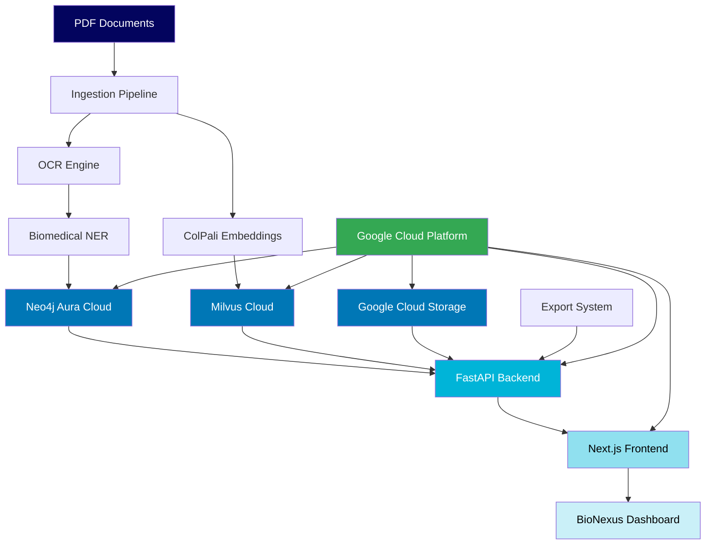

# BioNexus - AI-Powered Knowledge Graph for Biomedical Research

<div align="center">


**Cloud-native semantic search and knowledge discovery platform for biomedical publications**

[](https://www.python.org/downloads/)
[](https://fastapi.tiangolo.com)
[](https://nextjs.org)
[](https://neo4j.com)

</div>

## 🚀 Overview

BioNexus transforms biomedical publications into an intelligent, searchable knowledge graph using cloud-native AI services. Using 608 research papers, instantly discover hidden connections, entities, and insights through advanced semantic search.

### Key Features

🔬 **Smart Document Processing**
- OCR-powered PDF extraction and analysis
- Biomedical NER with SciSpacy
- Automated entity and relation extraction

🧠 **AI-Powered Search**  
- ColPali multimodal embeddings (text + visual)
- Semantic similarity search via Milvus Cloud
- RAG system with citation tracking

📊 **Interactive Knowledge Graph**
- Neo4j Aura cloud database
- Real-time visualization and exploration
- Entity relationship mapping

🌐 **Cloud-Native Architecture**
- Fully managed cloud services
- Auto-scaling infrastructure  
- Enterprise-grade security

## 🏗️ Architecture



### Technology Stack

**Backend** 🔧
- **FastAPI**: High-performance Python web framework
- **Neo4j Aura**: Cloud knowledge graph database
- **Milvus Cloud**: Scalable vector similarity search
- **SciSpacy**: Biomedical NLP pipeline
- **ColPali**: Multimodal document embeddings
- **Tesseract OCR**: Document text extraction

**Frontend** 🎨  
- **Next.js 14**: React-based web framework
- **TypeScript**: Type-safe development
- **Tailwind CSS**: Utility-first styling
- **Cytoscape.js**: Graph visualization
- **React Query**: Data fetching and caching

**Cloud Infrastructure** �
- **Google Cloud Platform**: Scalable cloud infrastructure
- **Google Cloud Storage**: Object storage for documents
- **Docker & Docker Compose**: Containerized deployment
- **Terraform**: Infrastructure as Code
- **GitHub Actions**: CI/CD pipeline

## � Quick Start

**BioNexus is cloud-ready!** You just need to set up cloud service credentials to get started.

### Prerequisites
- Docker & Docker Compose
- Cloud service accounts (Neo4j Aura, Milvus Cloud, Google Cloud, OpenAI)

### Setup Steps
1. **Clone the repository**
```bash
git clone https://github.com/CypherKingdom/bionexus.git
cd bionexus
```

2. **Follow the complete setup guide**
```bash
# Read the detailed next steps
cat NEXT_STEPS.md
```

3. **Quick deployment**
```bash
# After setting up .env with your credentials
docker-compose up -d

# Access at: http://localhost:3000
```

### Required Services
- **Neo4j Aura** - Knowledge graph database
- **Milvus Cloud** - Vector similarity search  
- **Google Cloud Storage** - Document storage
- **OpenAI API** - AI/ML services

**📋 See `NEXT_STEPS.md` for detailed setup instructions**

## 💡 How It Works

1. **Upload Documents** - Drop your biomedical PDFs into the system
2. **AI Processing** - Automatic OCR, NER, and entity extraction
3. **Knowledge Graph** - Entities and relationships stored in Neo4j Aura
4. **Vector Search** - Document embeddings indexed in Milvus Cloud
5. **Intelligent Queries** - Ask questions and get AI-powered answers with citations

## 📊 Core Features

### API Endpoints
- **Document Processing**: Upload and analyze biomedical papers
- **Semantic Search**: Multi-modal similarity search across documents
- **Knowledge Graph**: Explore entity relationships and connections
- **RAG System**: Ask questions and get AI-generated answers with citations
- **Export Tools**: Extract data in various formats for analysis

### Built-in Dashboards
- **Pipeline Monitor**: Track document processing status
- **Knowledge Graph Viewer**: Interactive entity relationship visualization  
- **Search Interface**: Advanced query builder with filters
- **Export System**: Data export in various formats

### API Documentation
Once running, visit `http://localhost:8000/docs` for interactive API documentation.

## 🛠️ Development & Contributing

### Running Tests
```bash
# Backend tests
cd backend && pytest tests/ -v

# Frontend tests  
cd frontend && npm test
```

### Code Standards
- Python: PEP 8 with Black formatter
- TypeScript: ESLint + Prettier
- 90%+ test coverage required

### Contributing
1. Fork the repository
2. Create feature branch: `git checkout -b feature-name`
3. Make changes with tests
4. Submit pull request

## 🆘 Troubleshooting

### Common Issues
- **Connection Errors**: Verify credentials in `.env` file
- **Container Issues**: `docker-compose logs` for debugging
- **Performance**: Increase Docker memory to 8GB+

### Getting Help
- Check `NEXT_STEPS.md` for setup instructions
- Review API docs at `http://localhost:8000/docs`  
- Monitor logs: `docker-compose logs -f`

## � What's Next?

**🎯 Your BioNexus platform is ready for deployment!**

**👉 Follow the detailed instructions in `NEXT_STEPS.md` to:**
1. Set up cloud service accounts
2. Configure credentials  
3. Deploy the application
4. Upload your biomedical research data

## 📄 License

MIT License - see [LICENSE](LICENSE) file for details.

## � Acknowledgments

Built with: **Neo4j Aura** • **Milvus Cloud** • **Google Cloud** • **OpenAI** • **FastAPI** • **Next.js**

---

<div align="center">

**🧬 Unlock the power of biomedical knowledge with AI 🔬**

</div>
