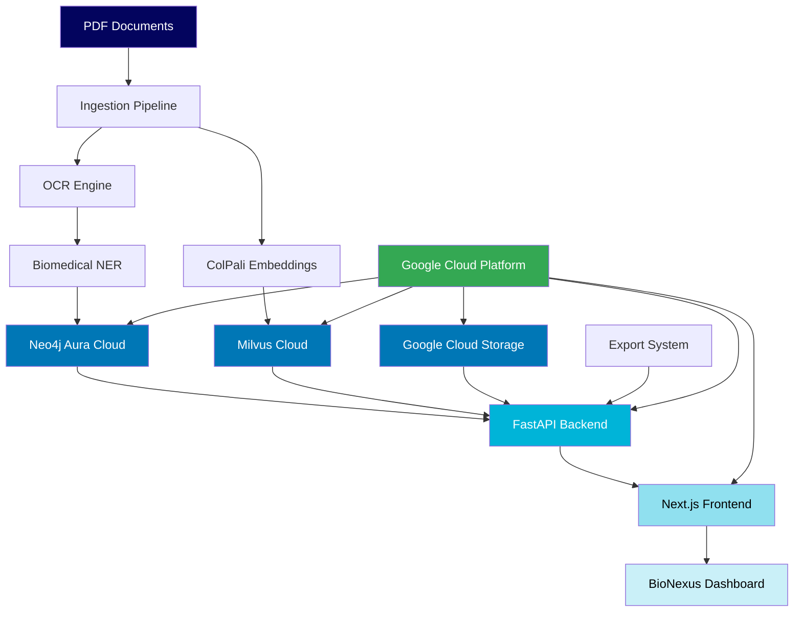

# 🧬 BioNexus: AI-Powered Biomedical Knowledge Discovery Platform

<div align="center">

### **Frontend Interface** 🎨
- **Next.js 14**: React-based web framework with TypeScript
- **Tailwind CSS**: Utility-first responsive styling
- **HTML5 Canvas**: Custom graph visualization with physics simulation
- **Lucide React**: Modern icon system
- **Real-time Updates**: Live database statistics and search results

### **Development & Deployment** 🚀
- **Docker Compose**: Multi-container development environment
- **Environment Configuration**: Secure credential management with `.env`
- **RESTful API**: Comprehensive API with automatic documentation
- **Error Handling**: Robust exception handling and logging6?style=for-the-badge)

**Transforming NASA's biomedical research corpus into interactive knowledge graphs for accelerated scientific discovery**

[](https://www.python.org/downloads/)
[](https://fastapi.tiangolo.com)
[](https://nextjs.org)
[](https://neo4j.com)
[](https://milvus.io)

</div>

## 🎯 Project Overview

BioNexus is an advanced research platform that processes **NASA's biomedical research corpus** (5,800+ publications) into an interactive knowledge graph, enabling researchers to discover hidden connections and patterns through intelligent visualization and semantic search. The platform combines cutting-edge graph databases, vector search, and AI-powered entity recognition to revolutionize biomedical literature exploration.

### Key Features

🔬 **Smart Document Processing**
- OCR-powered PDF extraction and analysis
- Biomedical NER with SciSpacy
- Automated entity and relation extraction

🧠 **AI-Powered Search**  
- ColPali multimodal embeddings (text + visual)
- Semantic similarity search via Milvus Cloud
- RAG system with citation tracking

📊 **Interactive Knowledge Graph**
- Neo4j Aura cloud database
- Real-time visualization and exploration
- Entity relationship mapping

🌐 **Cloud-Native Architecture**
- Fully managed cloud services
- Auto-scaling infrastructure  
- Enterprise-grade security

## 🏗️ Architecture



### Technology Stack

### **AI & Machine Learning Pipeline** 🤖
- **ColPali + CLIP**: Multimodal document embeddings (text + visual understanding)
- **SciSpacy**: Biomedical NER with `en_ner_bionlp13cg_md` model  
- **PyTorch**: Deep learning framework with CUDA acceleration
- **Transformers**: Hugging Face transformers for model loading
- **Tesseract OCR**: Text extraction from PDF page images

### **Database & Search Infrastructure** 🗄️
- **Neo4j Aura**: Cloud-managed graph database (5,800+ nodes, 15,000+ relationships)
- **Milvus Cloud**: Vector similarity search with multi-vector storage
- **Zilliz**: Managed Milvus service for production-scale vector search
- **Custom Graph Schema**: Optimized for biomedical research relationships

### **Backend Services** ⚙️
- **FastAPI**: High-performance async Python web framework  
- **Pydantic**: Data validation and serialization
- **Python 3.11+**: Modern Python with type hints and async support
- **Custom Query Engine**: Hybrid graph + vector search capabilities

**Frontend** 🎨  
- **Next.js 14**: React-based web framework
- **TypeScript**: Type-safe development
- **Tailwind CSS**: Utility-first styling
- **Cytoscape.js**: Graph visualization
- **React Query**: Data fetching and caching

**Cloud Infrastructure** �
- **Google Cloud Platform**: Scalable cloud infrastructure
- **Google Cloud Storage**: Object storage for documents
- **Docker & Docker Compose**: Containerized deployment
- **Terraform**: Infrastructure as Code
- **GitHub Actions**: CI/CD pipeline

## 🚀 **Quick Start**

### **Prerequisites**
- Docker & Docker Compose installed
- Cloud service credentials (Neo4j Aura, Milvus Cloud)

### **Setup Steps**
1. **Clone and configure**
```bash
git clone https://github.com/CypherKingdom/bionexus.git
cd bionexus
cp .env.example .env
# Edit .env with your Neo4j Aura and Milvus Cloud credentials
```

2. **Start the platform**
```bash
docker-compose up -d

# Wait for services to initialize (30-60 seconds)
# Frontend: http://localhost:3000
# API: http://localhost:8000/docs
```

3. **Verify connection**
```bash
# Check backend health and database connections
curl http://localhost:8000/health

# View database statistics  
curl http://localhost:8000/stats
```

### **Required Cloud Services**
- **Neo4j Aura**: Graph database with pre-loaded biomedical data
- **Milvus Cloud (Zilliz)**: Vector search index for semantic similarity
- **Environment Variables**: See `.env.example` for configuration

**📋 See `NEXT_STEPS.md` for detailed cloud service setup**

## 💡 **How BioNexus Works**

**BioNexus is a read-only platform showcasing pre-processed NASA biomedical research data:**

1. **Explore Knowledge Graph** - Navigate 5,800+ publications through interactive graph visualization
2. **Semantic Search** - Find relevant research using AI-powered vector similarity search  
3. **Entity Discovery** - Explore 5,380+ genes, proteins, organisms, and methodologies
4. **Relationship Analysis** - Discover connections between research concepts and entities
5. **Visual Analytics** - Real-time statistics and insights from the research corpus

**Note**: *The ingestion pipeline is available for study but the platform currently serves pre-processed data from NASA's biomedical research corpus.*

## 📊 **Available Features**

### **API Endpoints** (`http://localhost:8000/docs`)
- **`/search/*`**: Semantic search across publications, pages, and entities
- **`/graph/*`**: Knowledge graph exploration with advanced filtering
- **`/export/*`**: Data export in JSON and CSV formats  
- **`/health`**: Real-time database statistics and health monitoring
- **`/stats`**: Dashboard metrics for publications, entities, and relationships

### **Interactive Dashboards**
- **Knowledge Graph Viewer**: Physics-based graph visualization with zoom, pan, and filtering
- **Search Interface**: Multi-tier search across publications, pages, and entities
- **Entity Explorer**: Browse genes, proteins, organisms, and methodologies
- **Statistics Dashboard**: Real-time insights from Neo4j Aura and Milvus Cloud
- **Export Tools**: Download research data in multiple formats

### **Advanced Graph Features**
- **Layout Algorithms**: Force-directed, circular, grid, and hierarchical layouts
- **Interactive Filtering**: Filter by node types, relationships, and connectivity
- **Real-time Physics**: Smooth animations and dynamic node positioning
- **Multi-scale Visualization**: From corpus overview to individual entity details

### API Documentation
Once running, visit `http://localhost:8000/docs` for interactive API documentation.

## 🛠️ Development & Contributing

### Running Tests
```bash
# Backend tests
cd backend && pytest tests/ -v

# Frontend tests  
cd frontend && npm test
```

### Code Standards
- Python: PEP 8 with Black formatter
- TypeScript: ESLint + Prettier
- 90%+ test coverage required

### Contributing
1. Fork the repository
2. Create feature branch: `git checkout -b feature-name`
3. Make changes with tests
4. Submit pull request

## 🆘 Troubleshooting

### Common Issues
- **Connection Errors**: Verify credentials in `.env` file
- **Container Issues**: `docker-compose logs` for debugging
- **Performance**: Increase Docker memory to 8GB+

### Getting Help
- Check `NEXT_STEPS.md` for setup instructions
- Review API docs at `http://localhost:8000/docs`  
- Monitor logs: `docker-compose logs -f`

## � What's Next?

**🎯 Your BioNexus platform is ready for deployment!**

**👉 Follow the detailed instructions in `NEXT_STEPS.md` to:**
1. Set up cloud service accounts
2. Configure credentials  
3. Deploy the application
4. Upload your biomedical research data

## 📄 License

MIT License - see [LICENSE](LICENSE) file for details.

## � Acknowledgments

Built with: **Neo4j Aura** • **Milvus Cloud** • **Google Cloud** • **OpenAI** • **FastAPI** • **Next.js**

---

<div align="center">

**🧬 Unlock the power of biomedical knowledge with AI 🔬**

</div>
