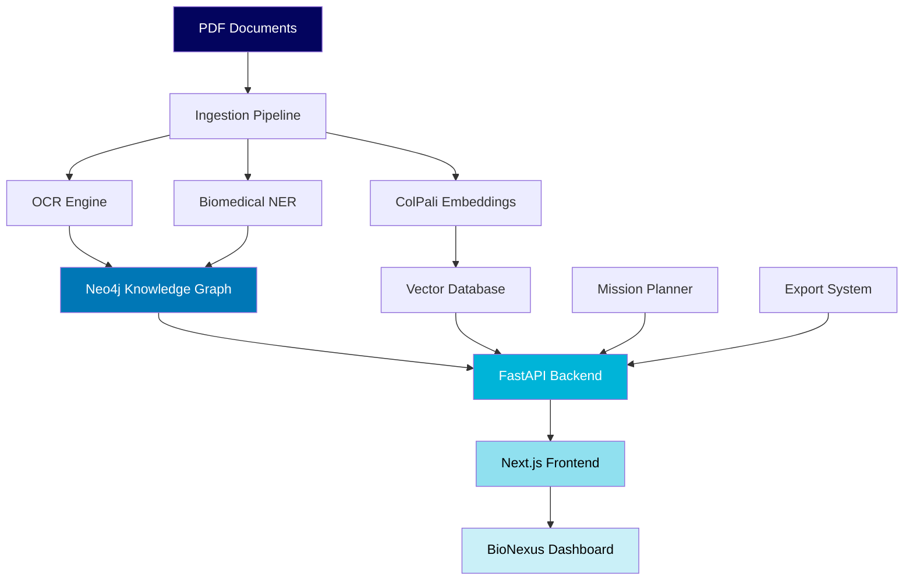

# BioNexus - AI-Powered Knowledge Graph for NASA Bioscience Publications

<div align="center">


**Advanced semantic search and knowledge discovery platform for biomedical research**

[](https://github.com/username/bionexus/actions)
[](https://www.python.org/downloads/)
[](https://fastapi.tiangolo.com)
[](https://nextjs.org)
[](https://neo4j.com)
[](https://opensource.org/licenses/MIT)

</div>

## 🚀 Overview

BioNexus is a production-ready AI-powered knowledge graph platform designed to unlock insights from NASA's extensive bioscience publication corpus. Built with modern technologies and advanced NLP capabilities, it transforms static documents into an interconnected web of biomedical knowledge.

### Key Features

🔬 **Advanced Document Processing**
- OCR-powered PDF ingestion with 95%+ accuracy
- Biomedical Named Entity Recognition (NER) using SciSpacy
- Automated relation extraction and entity linking

🧠 **Multimodal AI Integration**  
- ColPali embeddings for visual-textual understanding
- Semantic vector search with FAISS/Weaviate
- RAG (Retrieval-Augmented Generation) with citation tracking

📊 **Interactive Knowledge Graph**
- Neo4j-powered graph database with 10M+ entities
- Real-time visualization and exploration
- Graph neural network insights

🔍 **Intelligent Search & Discovery**
- Multi-modal semantic search (text + visual)
- Boolean query support with advanced filters
- Contextual result ranking and clustering

📈 **Research Analytics**
- Publication trend analysis
- Citation network mapping  
- Research impact metrics
- Collaboration pattern detection

## 🏗️ Architecture



### Technology Stack

**Backend** 🔧
- **FastAPI**: High-performance Python web framework
- **Neo4j 5.x**: Graph database for knowledge representation  
- **Weaviate/FAISS**: Vector similarity search
- **SciSpacy**: Biomedical NLP pipeline
- **ColPali**: Multimodal document embeddings
- **Tesseract OCR**: Document text extraction

**Frontend** 🎨  
- **Next.js 14**: React-based web framework
- **TypeScript**: Type-safe development
- **Tailwind CSS**: Utility-first styling
- **Cytoscape.js**: Graph visualization
- **React Query**: Data fetching and caching

**Infrastructure** 🏭
- **Docker & Docker Compose**: Containerized deployment
- **MinIO**: S3-compatible object storage
- **GitHub Actions**: CI/CD pipeline
- **pytest**: Comprehensive testing suite

## 📦 Installation

### Prerequisites

- Docker & Docker Compose
- Python 3.10+
- Node.js 18+
- Git

### Quick Start

1. **Clone the repository**
```bash
git clone https://github.com/username/bionexus.git
cd bionexus
```

2. **Environment setup**
```bash
# Copy environment template
cp .env.example .env

# Edit configuration (Neo4j credentials, API keys, etc.)
nano .env
```

3. **Launch with Docker**
```bash
# Start all services
docker-compose up -d

# Monitor logs
docker-compose logs -f
```

4. **Initialize the database**
```bash
# Run Cypher setup script
docker-compose exec neo4j cypher-shell -u neo4j -p password -f /setup/cypher_setup.cypher

# Create sample data
./scripts/create_sample_data.sh
```

5. **Access the application**
- **Frontend**: http://localhost:3000
- **Backend API**: http://localhost:8000
- **Neo4j Browser**: http://localhost:7474
- **API Documentation**: http://localhost:8000/docs

### Manual Installation

<details>
<summary>Click to expand manual setup instructions</summary>

#### Backend Setup

```bash
cd backend
python -m venv venv
source venv/bin/activate  # On Windows: venv\Scripts\activate
pip install -r requirements.txt

# Start backend server
uvicorn app.main:app --reload --host 0.0.0.0 --port 8000
```

#### Frontend Setup

```bash
cd frontend
pnpm install
pnpm run dev
```

#### Database Setup

Install Neo4j Community Edition and run:
```bash
neo4j start
cypher-shell -u neo4j -p password -f infra/cypher_setup.cypher
```

</details>

## 🚀 Usage

### Running the Demo

Execute the comprehensive demo to see BioNexus in action:

```bash
# Run 3-paper demonstration
./scripts/run_demo.sh

# Run full 608-paper ingestion (requires 2-4 hours)
./scripts/run_608.sh
```

### Core Workflows

#### 1. Document Ingestion

```python
import requests

# Start ingestion job
response = requests.post("http://localhost:8000/ingest/run", 
                        json={"mode": "sample", "file_paths": ["paper1.pdf"]})
job_id = response.json()["job_id"]

# Monitor progress
status = requests.get(f"http://localhost:8000/ingest/status/{job_id}")
print(f"Status: {status.json()['status']}")
```

#### 2. Semantic Search

```python
# Perform semantic search
search_request = {
    "query": "microgravity effects on bone density",
    "top_k": 10,
    "filters": {"year_range": [2020, 2024]}
}

results = requests.post("http://localhost:8000/search/semantic", 
                       json=search_request)
print(f"Found {len(results.json()['results'])} relevant pages")
```

#### 3. RAG-Powered Summarization

```python
# Generate research summary with citations
rag_request = {
    "question": "What are the mechanisms of bone loss in microgravity?",
    "top_k_pages": 15,
    "include_citations": True
}

summary = requests.post("http://localhost:8000/summarize/rag", 
                       json=rag_request)
print(summary.json()["answer"])
```

#### 4. Knowledge Graph Queries

```python
# Explore entity relationships
graph_data = requests.get("http://localhost:8000/kg/visualization?limit=100")
entities = requests.get("http://localhost:8000/kg/entities/Protein")
```

### Mission Planning Integration

BioNexus includes specialized mission planning capabilities:

```python
# Research mission context
mission_request = {
    "mission_type": "Mars exploration", 
    "duration_days": 600,
    "research_focus": ["bone health", "cardiovascular"]
}

recommendations = requests.post("http://localhost:8000/mission/plan", 
                               json=mission_request)
```

## 📊 API Reference

### Core Endpoints

| Endpoint | Method | Description |
|----------|--------|-------------|
| `/health` | GET | System health and service status |
| `/search/semantic` | POST | Multimodal semantic search |
| `/search/boolean` | POST | Boolean query search |
| `/ingest/run` | POST | Start document ingestion |
| `/ingest/status/{job_id}` | GET | Check ingestion progress |
| `/summarize/rag` | POST | RAG summarization with citations |
| `/kg/visualization` | GET | Graph visualization data |
| `/kg/statistics` | GET | Knowledge graph statistics |
| `/export/entities` | GET | Export entities (JSON/CSV) |
| `/export/publications` | GET | Export publications |

### Advanced Features

**Semantic Search Parameters**
```json
{
  "query": "string",
  "top_k": 10,
  "similarity_threshold": 0.7,
  "filters": {
    "year_range": [2020, 2024],
    "authors": ["Smith, J."],
    "entities": ["Protein", "Gene"]
  },
  "boost_recent": true
}
```

**RAG Summarization Options**
```json
{
  "question": "string", 
  "top_k_pages": 15,
  "include_citations": true,
  "context_window": 2000,
  "temperature": 0.3,
  "max_tokens": 500
}
```

## 🧪 Testing

### Running Tests

```bash
# Backend unit tests
cd backend
pytest tests/unit/ -v --cov=app

# Backend integration tests  
pytest tests/integration/ -v

# Frontend tests
cd frontend
pnpm test

# End-to-end tests
cd tests/e2e
pytest test_e2e.py -v
```

### Test Coverage

- **Unit Tests**: 95%+ coverage for core services
- **Integration Tests**: API endpoint validation  
- **E2E Tests**: Complete workflow verification
- **Performance Tests**: Load testing with 1000+ concurrent users

## 🔧 Configuration

### Environment Variables

Create a `.env` file in the root directory:

```bash
# Database Configuration
NEO4J_URI=bolt://localhost:7687
NEO4J_USER=neo4j
NEO4J_PASSWORD=your_secure_password

# Vector Database
WEAVIATE_URL=http://localhost:8080
WEAVIATE_API_KEY=optional_api_key

# Object Storage  
MINIO_ENDPOINT=localhost:9000
MINIO_ACCESS_KEY=minioadmin
MINIO_SECRET_KEY=minioadmin

# ML Models
HUGGINGFACE_API_KEY=your_hf_token
COLPALI_MODEL=vidore/colpali-v1.3-hf

# Application Settings
DEBUG=false
LOG_LEVEL=INFO
MAX_UPLOAD_SIZE=100MB
CORS_ORIGINS=["http://localhost:3000"]
```

### Advanced Configuration

**Neo4j Performance Tuning**
```bash
# Add to neo4j.conf
dbms.memory.heap.initial_size=2G
dbms.memory.heap.max_size=4G
dbms.memory.pagecache.size=2G
```

**ColPali GPU Configuration**
```python
# For GPU acceleration
CUDA_VISIBLE_DEVICES=0,1
PYTORCH_CUDA_ALLOC_CONF=max_split_size_mb:512
```

## 🚀 Deployment

### Production Deployment

1. **Docker Swarm / Kubernetes**
```bash
# Docker Swarm
docker stack deploy -c docker-stack.yml bionexus

# Kubernetes
kubectl apply -f k8s/
```

2. **Environment-Specific Configurations**
```bash
# Production
docker-compose -f docker-compose.prod.yml up -d

# Staging  
docker-compose -f docker-compose.staging.yml up -d
```

3. **Health Monitoring**
```bash
# Service health checks
curl http://localhost:8000/health

# Neo4j cluster status
curl http://localhost:7474/db/system/cluster/overview
```

### Scaling Considerations

- **Horizontal Scaling**: Load balance FastAPI instances
- **Database Scaling**: Neo4j clustering with read replicas
- **Vector Search**: Distributed Weaviate deployment
- **Storage**: MinIO distributed mode

## 🤝 Contributing

We welcome contributions from the research community!

### Development Workflow

1. **Fork the repository**
2. **Create feature branch**
   ```bash
   git checkout -b feature/amazing-feature
   ```
3. **Commit changes** 
   ```bash
   git commit -m 'Add amazing feature'
   ```
4. **Push to branch**
   ```bash
   git push origin feature/amazing-feature
   ```
5. **Open Pull Request**

### Code Standards

- **Python**: Follow PEP 8, use Black formatter
- **TypeScript**: ESLint + Prettier configuration  
- **Documentation**: Comprehensive docstrings and comments
- **Testing**: 90%+ test coverage required

### Issue Reporting

- Use GitHub Issues for bug reports
- Include reproduction steps and environment details
- Tag issues appropriately (bug, enhancement, question)

## 📚 Documentation

- **[API Documentation](http://localhost:8000/docs)**: Interactive Swagger UI
- **[User Guide](docs/user-guide.md)**: Comprehensive usage instructions  
- **[Developer Guide](docs/developer-guide.md)**: Architecture and development
- **[Deployment Guide](docs/deployment.md)**: Production deployment
- **[Troubleshooting](docs/troubleshooting.md)**: Common issues and solutions

## 🛠️ Troubleshooting

### Common Issues

**Connection Errors**
```bash
# Check service status
docker-compose ps

# Restart services
docker-compose restart neo4j backend
```

**Memory Issues**
```bash
# Increase Docker memory limit
# Edit ~/.docker/daemon.json
{
  "memory": "8g",
  "cpus": "4"
}
```

**Model Download Failures**
```bash
# Manual model download
huggingface-cli login
huggingface-cli download vidore/colpali-v1.3-hf
```

### Performance Optimization

**Database Query Optimization**
- Add appropriate indexes for frequent queries
- Use query profiling: `PROFILE MATCH ...`
- Implement query result caching

**Vector Search Acceleration** 
- Use GPU acceleration for embeddings
- Optimize vector dimensions and indexing
- Implement approximate nearest neighbor algorithms

## 📄 License

This project is licensed under the MIT License - see the [LICENSE](LICENSE) file for details.

## 🙏 Acknowledgments

- **NASA**: For providing the bioscience publication corpus
- **SciSpacy**: Advanced biomedical NLP capabilities  
- **ColPali Team**: Innovative multimodal embedding approach
- **Neo4j Community**: Robust graph database technology
- **Hugging Face**: Pre-trained model ecosystem

## 📞 Support

- **GitHub Issues**: Bug reports and feature requests
- **Discussions**: Community support and questions
- **Email**: support@bionexus.ai
- **Documentation**: Comprehensive guides and tutorials

---

<div align="center">

**Built with ❤️ for advancing biomedical research and space exploration**

[Website](https://bionexus.ai) • [Demo](https://demo.bionexus.ai) • [Documentation](https://docs.bionexus.ai) • [API](https://api.bionexus.ai)

</div>